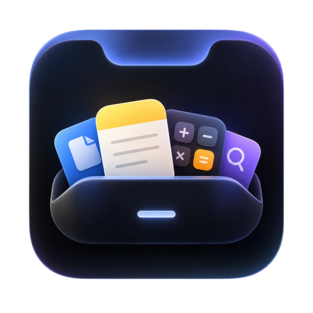
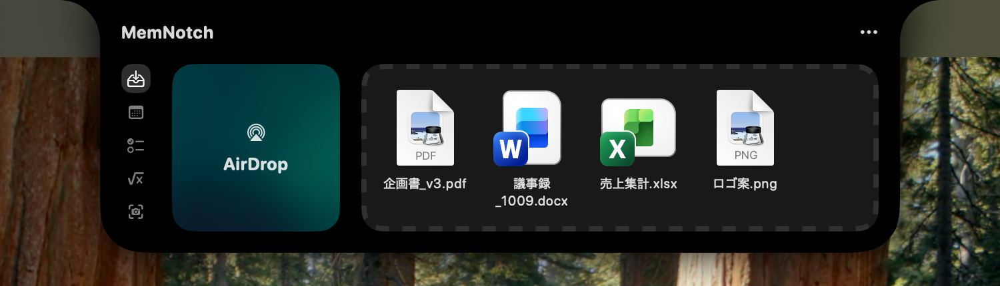
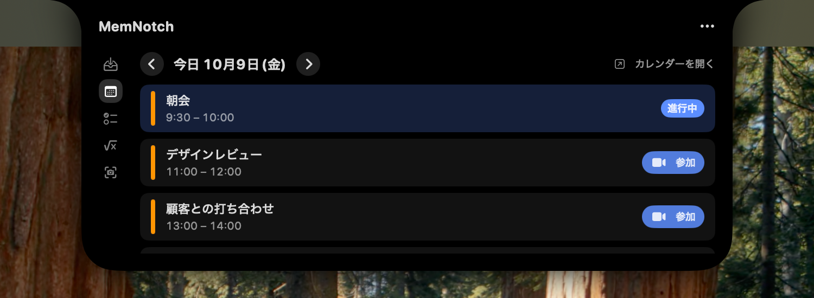
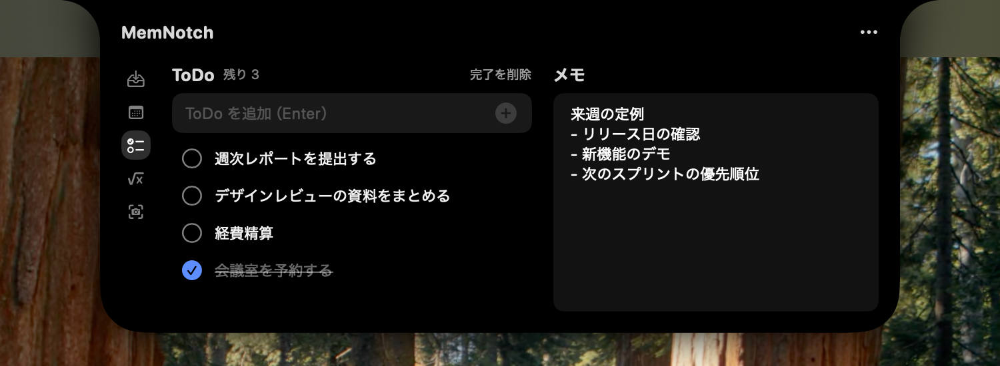
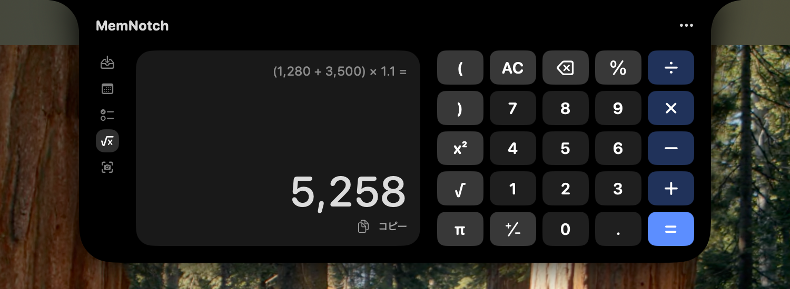
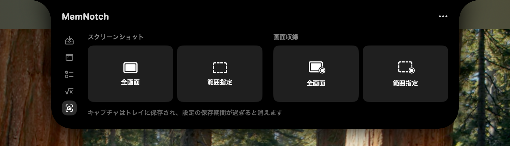
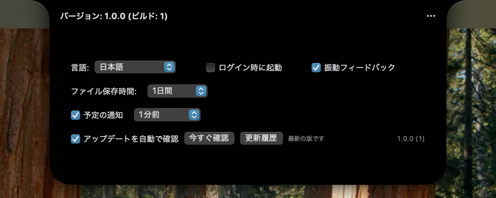

<p align="center">
  
</p>

<h1 align="center">MemNotch</h1>

<p align="center">
  MacBook のノッチを、ファイル置き場・予定・ToDo・電卓・キャプチャの入口にする macOS アプリ
</p>

<p align="center">
  <a href="https://github.com/mem-shibata/MemNotch-releases/releases/latest"></a>
  
  <a href="#インストール"></a>
</p>

<p align="center">
  
</p>

<p align="center">
  <a href="#機能">機能</a> ·
  <a href="#インストール">インストール</a> ·
  <a href="#使い方">使い方</a> ·
  <a href="#更新">更新</a> ·
  <a href="#通信とプライバシー">通信とプライバシー</a> ·
  <a href="#よくある質問">よくある質問</a>
</p>

---

ノッチにマウスを合わせてクリックすると、ノッチが広がってパネルになります。左端のタブで、トレイ・カレンダー・ToDo とメモ・電卓・キャプチャを切り替えます。使わないときはふつうのノッチに戻り、画面のじゃまをしません。

## 機能

### 📥 トレイ — ファイルの一時置き場

（いちばん上の画像がトレイです）

- ファイルをノッチまでドラッグすると、ノッチが開いてトレイに置けます。あとでトレイから別の場所へドラッグして取り出せます
- ファイルをクリックすると開きます。Option キーを押しながらクリックすると削除します
- AirDrop の枠にファイルを落とすと、そのまま AirDrop で送れます
- 置いたファイルは保存期間（1時間・1日・2日・3日・1週間・無期限・任意）を過ぎると自動で消えます

### 📅 カレンダー — 今日の予定と会議への参加



- macOS のカレンダーに登録した、その日の予定を一覧で表示します。矢印で前後の日に移動できます
- 進行中の予定には「進行中」と表示します
- Google Meet・Zoom・Microsoft Teams の URL がある予定には「参加」ボタンが出て、ワンクリックで会議に入れます
- 設定で「予定の通知」をオンにすると、予定の直前にノッチから波紋が広がって知らせます

### ✅ ToDo とメモ



- ToDo を追加して、完了・削除できます。完了したものはまとめて消せます
- 右側は自由に書けるメモです
- どちらも MemNotch を終了しても残ります

### 🧮 電卓



- 四則演算・カッコ・%・x²・√・π に対応しています
- ボタンでもキーボードでも入力できます。計算式は結果の上に表示されます
- 「コピー」で結果をクリップボードにコピーできます

### 📸 キャプチャ — スクリーンショットと画面収録



- 全画面・範囲指定のスクリーンショットと、全画面・範囲指定の画面収録ができます
- 撮ったものはトレイに入るので、そのままドラッグして資料やチャットに貼れます

### ⚙️ 設定



右上の「…」→「設定」から開きます。

- 表示言語（日本語・English・Deutsch・Français・简体中文・繁體中文）
- ログイン時に起動、振動フィードバック（トラックパッド）
- トレイのファイルの保存期間
- 予定の通知と、何分前に知らせるか
- 新しい版の自動確認と、更新履歴

## インストール

必要なもの：**macOS 14 以降**

### Homebrew（おすすめ）

```sh
brew tap mem-shibata/memnotch
brew trust --tap mem-shibata/memnotch   # Homebrew にこの tap を信頼させる設定（Homebrew 7 以降で必要）
brew install --cask memnotch
```

インストールが終わると MemNotch が起動します。

### zip から手動で入れる

1. [Releases](https://github.com/mem-shibata/MemNotch-releases/releases/latest) から `MemNotch-<バージョン>.zip` をダウンロードして展開します
2. `MemNotch.app` を「アプリケーション」フォルダに入れます
3. Apple の公証を受けていないため、最初の起動で「開発元を確認できません」と表示されます。Finder で MemNotch を右クリックし、「開く」を選んでください

### 最初に許可が必要なもの

使う機能に応じて、macOS から許可を求められます。

| 機能 | 必要な許可 |
| --- | --- |
| カレンダー | カレンダーへのアクセス |
| キャプチャ | 画面とシステムオーディオの録音 |

許可しなかった機能は使えませんが、ほかの機能はそのまま使えます。あとから「システム設定」→「プライバシーとセキュリティ」で変更できます。

## 使い方

| やりたいこと | 操作 |
| --- | --- |
| ノッチを開く | ノッチにマウスを合わせてクリック |
| ノッチを閉じる | ノッチの外をクリック |
| ファイルをトレイに置く | ファイルをノッチまでドラッグ |
| トレイのファイルを取り出す | トレイからドラッグ |
| トレイのファイルを削除する | Option キーを押しながらクリック |
| トレイを空にする | 右上の「…」→「消去」 |
| 設定を開く・終了する | 右上の「…」→「設定」／「終了」 |

## 更新

新しい版が出ると、ノッチの見出しに「新しいバージョンがあります」と表示されます。

```sh
brew upgrade --cask memnotch
```

MemNotch は自動で終了し、更新のあとに起動し直します。zip で入れた場合は、MemNotch を終了してから新しい `MemNotch.app` で上書きしてください。

どちらの場合も、データ（トレイ・ToDo・メモ・設定）は残ります。変更内容は設定の「更新履歴」か [Releases](https://github.com/mem-shibata/MemNotch-releases/releases) で確認できます。

## 通信とプライバシー

- MemNotch が外部と通信するのは、**新しい版が出ていないかを確認するときだけ**です（起動時と1日1回、このリポジトリの最新リリースを GitHub API に問い合わせる）。この確認は設定で止められます
- トレイのファイル、予定、ToDo、メモなどの内容を送ることはありません。データはすべてこの Mac の中に保存されます
- ログイン、アカウント、テレメトリ、解析 SDK はありません
- App Sandbox を有効にしています

## よくある質問

<details>
<summary>ノッチのない Mac でも使えますか？</summary>

使えます。内蔵ディスプレイにノッチがあればそこに、なければメインのディスプレイの上端の中央に、ノッチの代わりになる領域を作ります。

</details>

<details>
<summary>「開発元を確認できません」と表示されて開けません</summary>

Apple の公証を受けていないためです。Finder で MemNotch を右クリックし、「開く」を選んでください。

</details>

<details>
<summary>アンインストールするには？</summary>

```sh
brew uninstall --cask memnotch
```

zip で入れた場合は、MemNotch を終了してから「アプリケーション」フォルダの `MemNotch.app` を削除します。データも消す場合は `~/Library/Containers/jp.co.members.MemNotch` を削除してください。

</details>

## 謝辞

MemNotch は [NotchDrop](https://github.com/Lakr233/NotchDrop)（MIT License, Copyright (c) 2024 Lakr Aream）をもとに作っています。

また、このアプリケーションはO氏が生きていることにより実現しました。感謝いたします。
